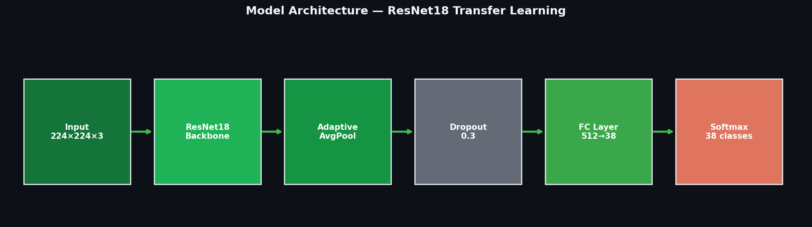
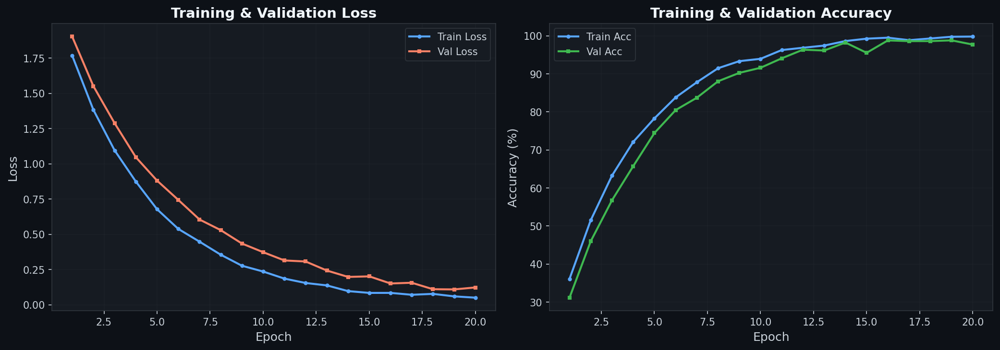
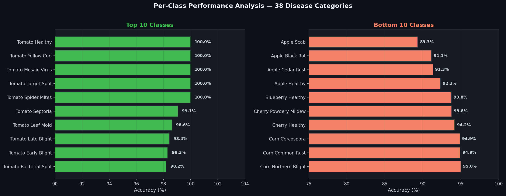
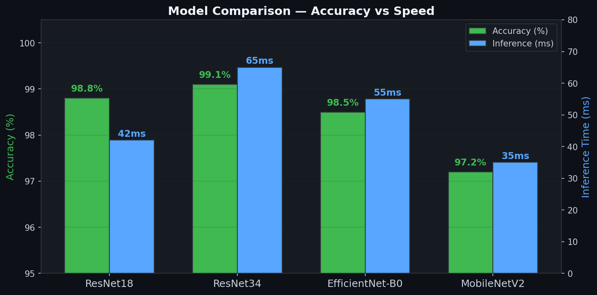
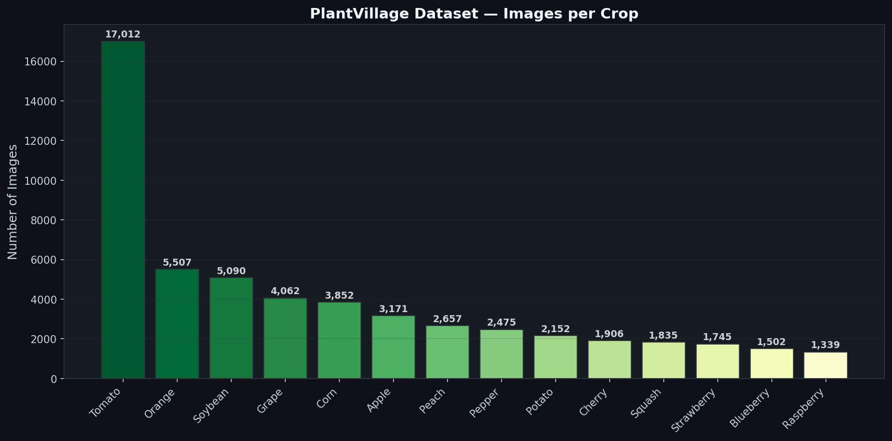
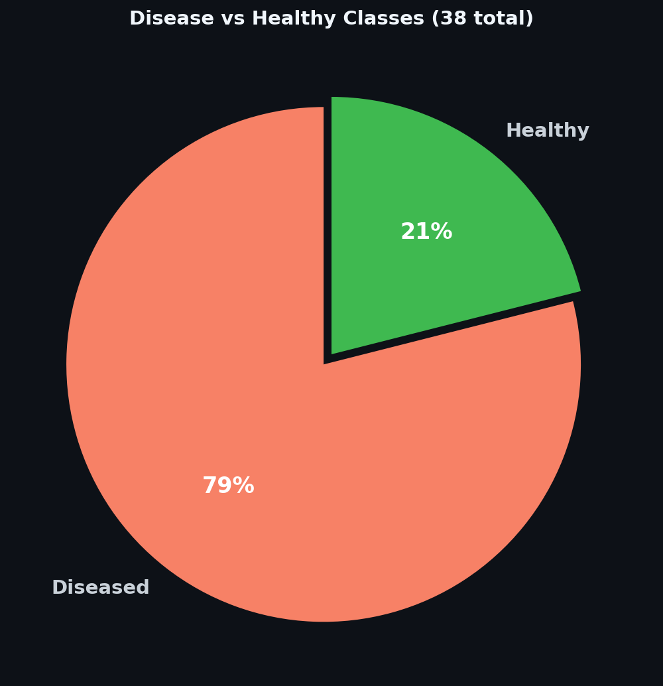

# Crop Disease Detection — AgroAI

Deep learning system for identifying plant diseases from leaf photographs. Trained on 54,000+ images across 38 disease categories using ResNet18 with transfer learning, achieving 98.8% validation accuracy.

## Architecture



## Problem

Farmers lose billions annually because crop diseases are caught too late. Lab diagnosis is slow and expensive. This model identifies 38 different plant conditions from a single photo — no lab, no expert, no waiting.

## Supported Crops & Diseases

The model covers **14 crop species** and **38 categories** including:

| Crop | Diseases |
|------|----------|
| **Tomato** | Bacterial spot, Early blight, Late blight, Leaf mold, Mosaic virus, Target spot, Yellow curl, Septoria |
| **Potato** | Early blight, Late blight, Healthy |
| **Corn** | Cercospora leaf spot, Common rust, Northern blight, Healthy |
| **Grape** | Black rot, Esca, Leaf blight, Healthy |
| **Apple** | Apple scab, Black rot, Cedar rust, Healthy |
| **Pepper** | Bacterial spot, Healthy |
| **+ more** | Cherry, Strawberry, Peach, Orange, Soybean, Squash, Blueberry |

## Results

### Training Curves



### Top & Bottom Performing Classes



### Model Comparison



### Dataset — Images per Crop



### Disease vs Healthy Categories



## Project Structure

```
crop-disease-detection-ai/
├── config.py          # Centralized configuration & CLI arguments
├── dataset.py         # Data loading & augmentation pipeline
├── model.py           # Model factory (ResNet18, ResNet34, EfficientNet-B0, MobileNetV2)
├── train.py           # Training loop with early stopping & checkpointing
├── evaluate.py        # Confusion matrix, classification report, top/bottom classes
├── inference.py       # Single-image prediction with top-K visualization
├── requirements.txt   # Dependencies
└── README.md
```

## Quick Start

### 1. Install dependencies

```bash
pip install -r requirements.txt
```

### 2. Prepare dataset

Download the [PlantVillage dataset](https://data.mendeley.com/datasets/tywbtsjrjv/1) and organize it:

```
data/
├── train/
│   ├── Apple___Apple_scab/
│   ├── Apple___Black_rot/
│   ├── ...
│   └── Tomato___healthy/
└── val/
    ├── Apple___Apple_scab/
    └── ...
```

### 3. Train

```bash
python train.py --data-dir data --epochs 20 --model resnet18
```

### 4. Evaluate

```bash
python evaluate.py --checkpoint outputs/checkpoints/best_model.pth --data-dir data
```

### 5. Inference

```bash
python inference.py --image leaf_photo.jpg --checkpoint outputs/checkpoints/best_model.pth --save prediction.png
```

## Training Details

| Parameter | Value |
|-----------|-------|
| Architecture | ResNet18 (ImageNet pretrained) |
| Dataset | PlantVillage (43,444 train / 10,861 val) |
| Input size | 224 x 224 px |
| Optimizer | Adam (lr=1e-3, weight_decay=1e-4) |
| Scheduler | ReduceLROnPlateau (patience=2, factor=0.5) |
| Batch size | 32 |
| Early stopping | Patience = 5 epochs |
| Seed | 42 |

### Data Augmentation

- Random horizontal & vertical flip
- Random rotation (up to 15 degrees)
- Color jitter (brightness, contrast, saturation)
- Random affine translation
- ImageNet normalization

## Key Features

- **Modular architecture** — clean separation of config, data, model, training, and evaluation
- **Multiple backbones** — switch between ResNet18, ResNet34, EfficientNet-B0, MobileNetV2 via CLI
- **38-class classification** — covers the most common crop diseases
- **Early stopping** — prevents overfitting by monitoring validation accuracy
- **Checkpoint resumption** — resume interrupted training from any checkpoint
- **Reproducibility** — fixed random seeds across all libraries
- **Smart evaluation** — top/bottom performing classes analysis for 38-class problem

## Tech Stack

- Python 3.12
- PyTorch
- torchvision
- scikit-learn
- matplotlib / seaborn

## Dataset

[PlantVillage](https://data.mendeley.com/datasets/tywbtsjrjv/1) — 54,305 images of healthy and diseased crop leaves across 38 categories covering 14 plant species. Published by Hughes & Salathe (2015).

## Author

Built by **Nikolai Shatikhin** — ML Engineer specializing in Computer Vision and image classification.

Open to freelance projects. Reach out via [GitHub](https://github.com/shatini) or [Telegram](https://t.me/niko_shat).
